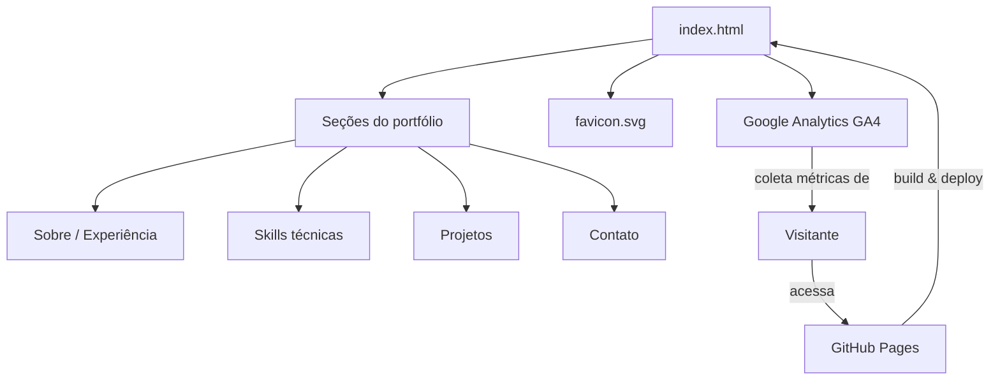

# Portfólio - João Madeira

Portfólio pessoal em HTML/CSS estático, hospedado no GitHub Pages, com foco em BI, FP&A e Engenharia de Dados.

🔗 [joaomadeir4.github.io/portfolio](https://joaomadeir4.github.io/portfolio/)

## Estrutura

## Stack

- HTML5 + CSS puro
- Google Fonts (Syne, Inter)
- Google Analytics (GA4) para métricas de acesso
- Deploy automático via GitHub Pages
